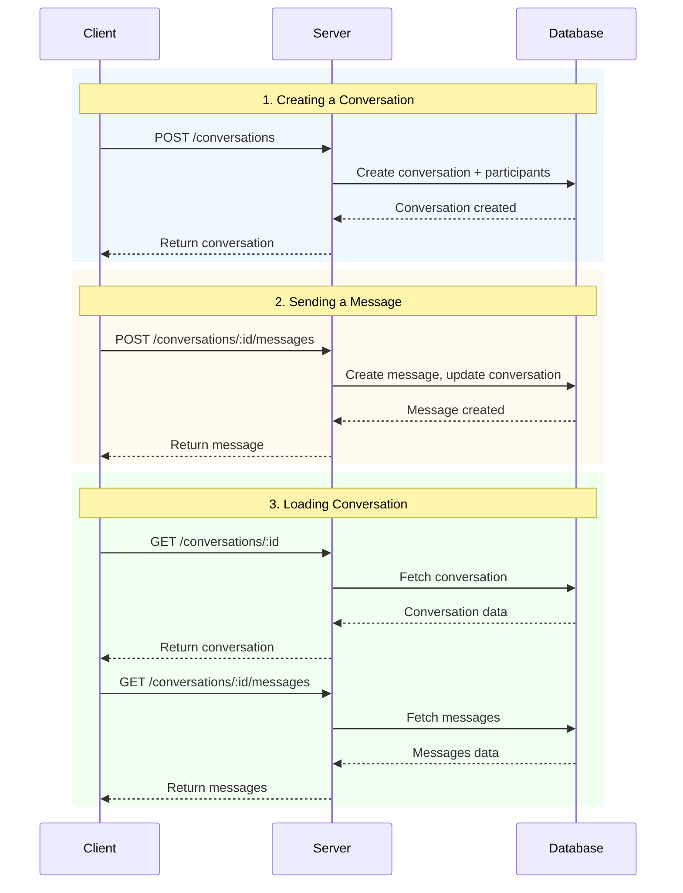

# Conversation Flow

## Sequence Diagram

## Flow Description

### 1. Creating a Conversation
- Client initiates conversation creation with POST request
- Server processes the request and creates conversation record with participants
- Database stores the conversation and participant associations
- Server returns the newly created conversation to the client

### 2. Sending a Message
- Client sends a message to an existing conversation
- Server creates the message record and updates conversation metadata (e.g., last message time)
- Database persists the message and updated conversation
- Server returns the created message to the client

### 3. Loading Conversation
- Client requests conversation details and messages in two separate calls
- Server fetches conversation data from database and returns it
- Client then requests all messages for that conversation
- Server fetches messages from database and returns them to the client