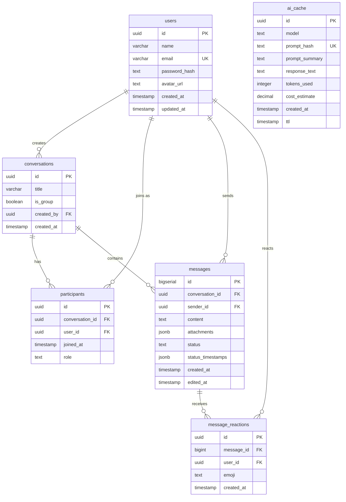

# 🗄️ Database Entity Relationship Diagram

Visual representation of the Chat AI App database schema.

---

## 📊 Entity Relationship Diagram



---

## 🔗 Relationship Explanations

### 1️⃣ users → conversations (created_by)
- **Type:** One-to-Many
- **Description:** A user can create multiple conversations
- **Cascade:** `ON DELETE SET NULL` - Preserves conversation if creator is deleted
- **Example:** Alice creates "Project Discussion" and "Team Chat"

### 2️⃣ users → participants (user_id)
- **Type:** One-to-Many
- **Description:** A user can participate in multiple conversations
- **Cascade:** `ON DELETE CASCADE` - Removes participation if user is deleted
- **Example:** Alice is a participant in both conversations

### 3️⃣ conversations → participants (conversation_id)
- **Type:** One-to-Many
- **Description:** A conversation can have multiple participants
- **Cascade:** `ON DELETE CASCADE` - Removes all participants if conversation is deleted
- **Example:** "Team Chat" has Alice, Bob, and Carol as participants

### 4️⃣ users → messages (sender_id)
- **Type:** One-to-Many
- **Description:** A user can send multiple messages
- **Cascade:** `ON DELETE SET NULL` - Preserves messages if sender is deleted
- **Example:** Alice sent 4 messages across conversations

### 5️⃣ conversations → messages (conversation_id)
- **Type:** One-to-Many
- **Description:** A conversation contains multiple messages
- **Cascade:** `ON DELETE CASCADE` - Deletes all messages if conversation is deleted
- **Example:** "Project Discussion" contains 3 messages

### 6️⃣ messages → message_reactions (message_id)
- **Type:** One-to-Many
- **Description:** A message can have multiple reactions
- **Cascade:** `ON DELETE CASCADE` - Removes all reactions if message is deleted
- **Example:** Alice's welcome message has 1 ❤️ reaction from Carol

### 7️⃣ users → message_reactions (user_id)
- **Type:** One-to-Many
- **Description:** A user can react to multiple messages
- **Cascade:** `ON DELETE CASCADE` - Removes all reactions if user is deleted
- **Example:** Bob reacted with 👍 to Alice's message

### 8️⃣ ai_cache (Independent)
- **Type:** Standalone table
- **Description:** No relationships - caches AI responses independently
- **Purpose:** Reduce API costs by storing frequently requested AI responses

---

## 🔑 Key Constraints

### Primary Keys
| Table | Column | Type | Description |
|-------|--------|------|-------------|
| `users` | `id` | UUID | Unique user identifier |
| `conversations` | `id` | UUID | Unique conversation identifier |
| `participants` | `id` | UUID | Unique participant record |
| `messages` | `id` | BIGSERIAL | Auto-incrementing message ID |
| `message_reactions` | `id` | UUID | Unique reaction identifier |
| `ai_cache` | `id` | UUID | Unique cache entry |

### Unique Constraints
| Table | Columns | Purpose |
|-------|---------|---------|
| `users` | `email` | Prevent duplicate accounts |
| `participants` | `(conversation_id, user_id)` | User can only join a conversation once |
| `message_reactions` | `(message_id, user_id, emoji)` | User can only react once with same emoji |
| `ai_cache` | `(model, prompt_hash)` | One cached response per model+prompt |

### Foreign Key Cascade Behavior
| Parent Table | Child Table | Column | ON DELETE |
|--------------|-------------|--------|-----------|
| `users` | `conversations` | `created_by` | SET NULL |
| `users` | `participants` | `user_id` | CASCADE |
| `users` | `messages` | `sender_id` | SET NULL |
| `users` | `message_reactions` | `user_id` | CASCADE |
| `conversations` | `participants` | `conversation_id` | CASCADE |
| `conversations` | `messages` | `conversation_id` | CASCADE |
| `messages` | `message_reactions` | `message_id` | CASCADE |

---

## 📐 Design Decisions

### Why UUID for most tables?
- ✅ **Security:** Prevents ID enumeration attacks
- ✅ **Distribution:** Works well across distributed systems
- ✅ **Privacy:** Harder to guess valid IDs
- ✅ **Merging:** No conflicts when merging databases

### Why BIGSERIAL for messages?
- ✅ **Performance:** Faster indexing and sorting
- ✅ **Ordering:** Natural chronological ordering
- ✅ **Pagination:** Efficient cursor-based pagination
- ✅ **Size:** Smaller storage footprint for high-volume data

### Why JSONB for attachments and status_timestamps?
- ✅ **Flexibility:** Schema can evolve without migrations
- ✅ **Querying:** PostgreSQL supports JSONB queries
- ✅ **Performance:** Binary format is faster than text JSON
- ✅ **Indexing:** Can create GIN indexes on JSONB fields

### Why separate participants table?
- ✅ **Many-to-Many:** Users can be in multiple conversations
- ✅ **Metadata:** Track role and join timestamp per participant
- ✅ **Flexibility:** Easy to add/remove participants
- ✅ **Permissions:** Role-based access control per conversation

---

## 🔍 Query Patterns

### Get all conversations for a user
```sql
SELECT c.* 
FROM conversations c
JOIN participants p ON c.id = p.conversation_id
WHERE p.user_id = 'user-uuid-here';
```

### Get all messages in a conversation with sender info
```sql
SELECT m.*, u.name AS sender_name, u.avatar_url
FROM messages m
JOIN users u ON m.sender_id = u.id
WHERE m.conversation_id = 'conversation-uuid-here'
ORDER BY m.created_at ASC;
```

### Get reaction counts for a message
```sql
SELECT emoji, COUNT(*) AS count
FROM message_reactions
WHERE message_id = 1001
GROUP BY emoji;
```

### Find AI cache hit
```sql
SELECT response_text
FROM ai_cache
WHERE model = 'gpt-4' 
  AND prompt_hash = 'hash-value-here'
  AND ttl > NOW();
```

---

## 📊 Cardinality Summary

```
users (1) ─────creates────── (0..*) conversations
users (1) ─────joins as───── (0..*) participants
users (1) ─────sends──────── (0..*) messages
users (1) ─────reacts─────── (0..*) message_reactions

conversations (1) ───has────── (1..*) participants
conversations (1) ───contains── (0..*) messages

messages (1) ────receives────── (0..*) message_reactions
```

**Key Points:**
- A conversation must have at least 1 participant (enforced at app level)
- A message can have 0 or more reactions
- A user can create 0 or more conversations
- The `ai_cache` table is independent with no relationships

---

## 🎯 Index Strategy

### Heavily Indexed Columns
- `users.email` - Login queries
- `participants.conversation_id` - List participants
- `participants.user_id` - User's conversations
- `messages.conversation_id` - Conversation history
- `messages.created_at` - Chronological sorting
- `ai_cache.(model, prompt_hash)` - Cache lookup

### Composite Indexes
- `messages(conversation_id, created_at DESC)` - Optimized pagination
- `ai_cache(model, prompt_hash)` - Fast cache hits

---

**Generated:** November 2025  
**Schema Version:** 1.0  
**Maintained by:** Chat AI App Team